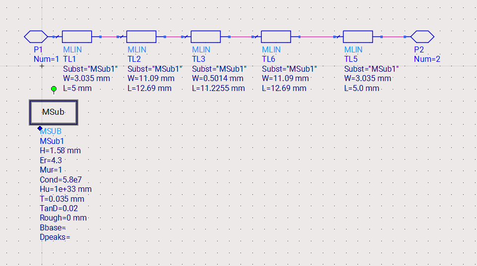
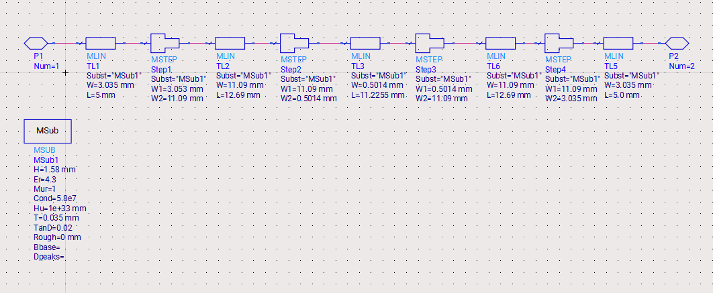
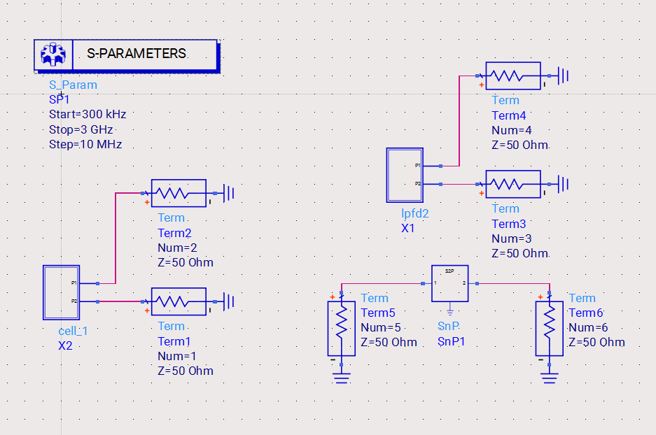
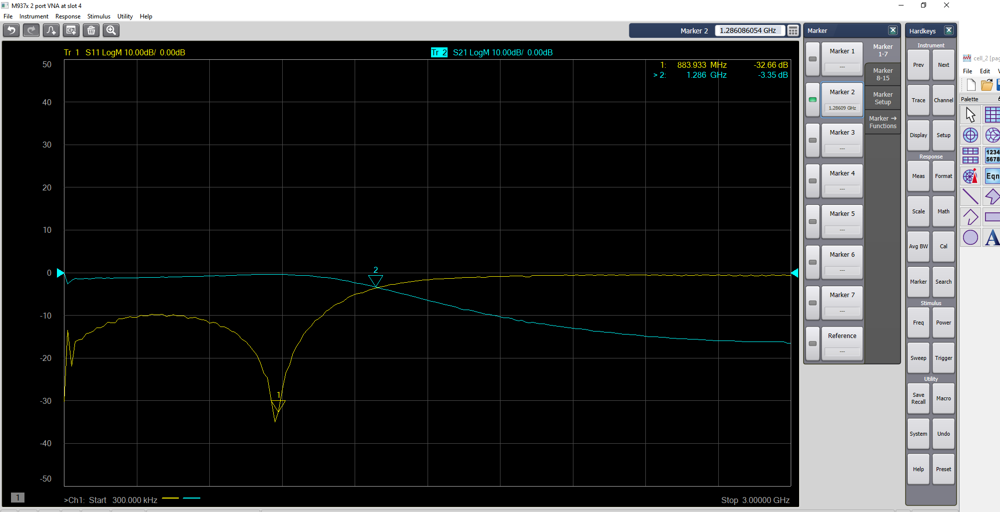

# Design and Characterization of a Microstrip Distributed Low-Pass Filter

## Project Overview

This project involved the **design, simulation, fabrication, and measurement of a distributed microstrip low-pass filter** operating near a cutoff frequency of approximately **1.25 GHz**.

The filter was implemented using microstrip transmission line sections rather than lumped inductors and capacitors. The design process involved:

* analytical design using prototype filter values
* parameter extraction using **MATLAB and ADS LineCalc**
* circuit simulation using **Keysight ADS**
* layout generation and fabrication
* **Vector Network Analyzer (VNA)** measurement
* comparison of simulated and measured **S-parameters**

This project demonstrates a complete **RF engineering workflow**, from theoretical design to physical measurement and validation.

# Filter Design Theory

At microwave frequencies, lumped inductors and capacitors are difficult to implement due to parasitic effects. Instead, filters are commonly implemented using **distributed transmission line sections**.

In this design:

* **High-impedance microstrip lines** approximate inductive elements.
* **Low-impedance microstrip lines** approximate capacitive elements.

The filter topology used a **three-section L–C–L configuration** derived from a low-pass prototype.

Using prototype values:

* ( g_1 = g_3 = 1.5963 )
* ( g_2 = 1.0967 )

and a target cutoff frequency of:

[
f_c = 1.25\ \text{GHz}
]

the electrical lengths for the transmission line sections were calculated. The design equations were implemented in MATLAB and verified with ADS LineCalc. The handwritten pre-lab calculations show the derivation of electrical lengths and conversion to physical microstrip dimensions. 

---

# Transmission Line Design

Using the substrate parameters:

| Parameter           | Value    |
| ------------------- | -------- |
| Dielectric constant | 4.3      |
| Substrate thickness | 1.58 mm  |
| Copper thickness    | 0.035 mm |
| Loss tangent        | 0.02     |

the microstrip dimensions were determined.

### Calculated Line Dimensions

| Section        | Characteristic Impedance | Electrical Length | Width    | Length   |
| -------------- | ------------------------ | ----------------- | -------- | -------- |
| 50 Ω feed line | 50 Ω                     | —                 | 3.075 mm | 5 mm     |
| Section 1      | 110 Ω                    | 41.57°            | 0.547 mm | 16.11 mm |
| Section 2      | 20 Ω                     | 25.13°            | 11.15 mm | 8.76 mm  |
| Section 3      | 110 Ω                    | 41.57°            | 0.547 mm | 16.11 mm |

These values were confirmed using **ADS LineCalc**, which produced similar dimensions. 

---

# ADS Circuit Simulation

Two circuit models were created in **Keysight ADS**.

### Model 1 — Ideal Microstrip Model

This model used only **MLIN transmission line elements** representing each microstrip section.

---

### Model 2 — Filter Including Discontinuities

A second schematic added **MSTEP elements** at each impedance transition.

These elements model:

* fringing fields
* impedance discontinuities
* effective electrical length changes

---

### High-Level Simulation Schematic

A higher-level schematic was created to simultaneously simulate:

* ideal model
* discontinuity model
* measured VNA data

---

# Simulated Frequency Response

The simulated response was obtained by plotting:

* **S11 (return loss)**
* **S21 (insertion loss)**

over the frequency range:

[
300\ \text{kHz} \rightarrow 3\ \text{GHz}
]

The results show:

* low insertion loss in the passband
* increasing attenuation beyond the cutoff frequency
* slight differences between the ideal and discontinuity models.

The discontinuity model produced a slightly shifted frequency response due to the change in **effective electrical length** of the microstrip sections.

---

# Filter Fabrication

The physical layout was generated automatically from the ADS schematic using the **ADS layout generation tool**.

The layout was exported as a **DXF file** and fabricated using the microwave lab PCB milling process.

The filter was assembled using **end-launch SMA connectors** to interface with measurement equipment.

---

# Measurement Setup

The filter was measured using a **Vector Network Analyzer (VNA)**.

Measurement procedure:

1. VNA calibrated from **300 kHz to 6 GHz**
2. Two-port calibration using SMA standards
3. Measurement of **S11 and S21**
4. Data exported as an **.s2p file**

The measurement results were imported into ADS to compare with the simulation models. 

---

# Measured Results

The VNA measurement shows the actual transmission and reflection characteristics of the fabricated filter.

Key observations:

* Passband insertion loss near **0 to −3 dB**
* Increasing attenuation above the cutoff frequency
* Good impedance match in the passband

---

# Simulation vs Measurement Comparison

The measured data was plotted alongside the ADS simulation models.

The comparison shows good agreement between measurement and simulation. Small deviations are expected due to:

* fabrication tolerances
* connector losses
* microstrip radiation
* substrate parameter uncertainty.

---

# Filter Performance

Approximate measured performance:

| Parameter                    | Result                            |
| ---------------------------- | --------------------------------- |
| Cutoff frequency             | ~1.3 GHz                          |
| Passband insertion loss      | ~3 dB                             |
| Maximum measured attenuation | >20 dB beyond 2 GHz               |
| Return loss                  | better than −40 dB near resonance |

---

# Discussion

Including the **MSTEP discontinuity elements** slightly altered the predicted filter response. This occurs because impedance transitions modify the effective electrical length of the transmission line sections.

As a result, the filter’s cutoff frequency shifts slightly compared to the ideal model.

This demonstrates an important principle in microwave design:

> physical discontinuities in transmission lines introduce parasitic effects that must be included for accurate prediction of circuit behavior.

Additionally, distributed filters inherently deviate from the ideal low-pass response due to:

* limited filter order
* transmission line losses
* imperfect impedance transitions.

---

# Conclusion

A distributed microstrip low-pass filter was successfully designed, simulated, fabricated, and measured.

The measured response showed good agreement with the ADS simulation, particularly when discontinuity modeling was included. This highlights the importance of accounting for microstrip transitions in microwave circuit design.

This project demonstrates practical experience with:

* microwave filter design
* microstrip transmission lines
* ADS circuit simulation
* RF measurement using a vector network analyzer
* comparison of simulated and measured S-parameters.
